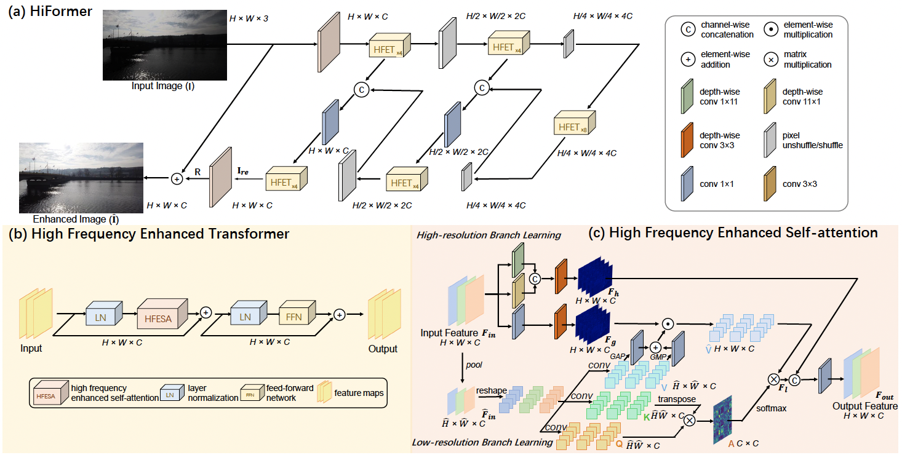
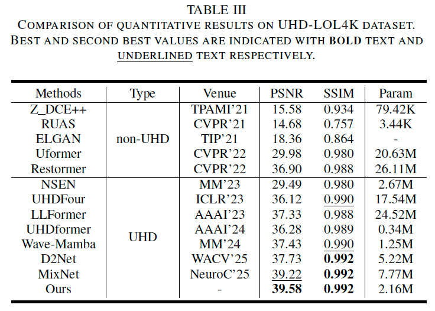
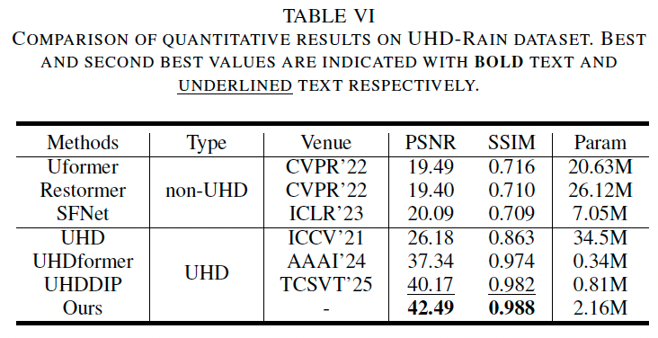
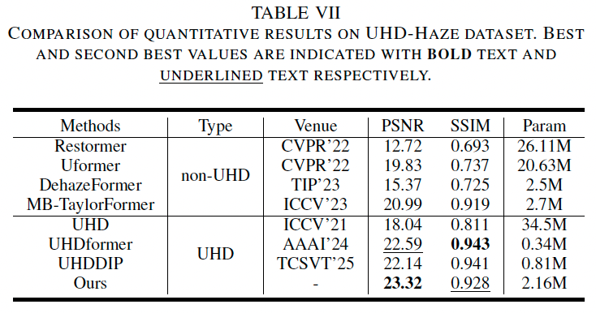
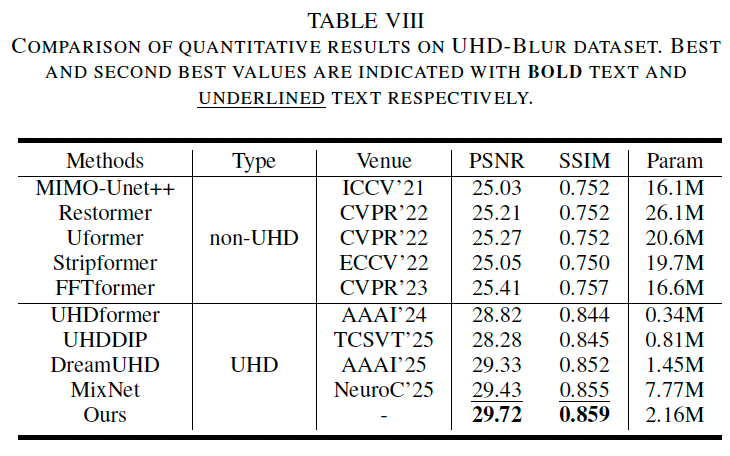
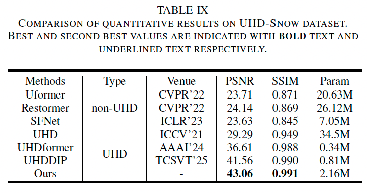

# Ultra-High-Definition Image Restoration via High Frequency Enhanced Transformer (T-CSVT 2025)

[Chen Wu](https://github.com/5chen), [Ling Wang](https://daviswang0.github.io/), [Zhuoran Zheng](https://scholar.google.com.hk/citations?user=pXzPL-sAAAAJ&hl=zh-CN), [Zhuoran Zheng](https://scholar.google.com.hk/citations?user=pXzPL-sAAAAJ&hl=zh-CN), Weidong Jiang, [Yuning Cui](https://www.ce.cit.tum.de/en/air/people/yuning-cui/)* and [Jingyuan Xia](https://www.xiajingyuan.com/)

<!-- [](https://arxiv.org/abs/2306.13090) -->
[](LICENSE)

<hr />

> **Abstract:** *HiFormer is a dual-branch Transformer architecture designed for Ultra-High-Definition (UHD) image restoration. It combines a high-resolution branch that preserves fine details using directionally-sensitive large-kernel convolutions with a low-resolution branch that models global context via self-attention. This collaboration effectively compensates for high-frequency losses caused by downsampling and attention mechanisms, enabling efficient and high-fidelity restoration on consumer-grade GPUs.* 

<hr />

## 📋 Table of Contents

- [Model Architecture](#️-model-architecture)
- [Features](#-features)
- [Installation](#-installation)
- [Project Structure](#-project-structure)
- [Dataset Preparation](#-dataset-preparation)
- [Training](#-training)
- [Testing](#-testing)
- [Results](#-results)
- [Tips & Tricks](#-tips--tricks)
- [Citation](#-citation)
- [Contact](#-contact)
- [Acknowledgments](#-acknowledgments)
- [License](#-license)

## 🏗️ Model Architecture

### HiFormer Overview



**High-Resolution Path:**

- Horizontal and vertical depthwise convolutions (1×11 and 11×1)
- Captures local structural information

**Low-Resolution Path:**

- Spatial reduction (4× downsampling)
- Multi-head self-attention
- Captures global dependencies

### Model Statistics

- **Parameters**: ~2.16M
-  **Inference Memory**: <24G for UHD (4K) Images, even smaller for BF16 precision.

## ✨ Features

### Supported Tasks

| Task | Dataset Code | Dataset | Description |
|------|--------------|---------|-------------|
| **Dehazing** | `uhd-haze` | UHD-Haze | Remove haze from UHD images |
| **Deblurring** | `uhd-blur` | UHD-Blur | Remove blur from UHD images |
| **Low-Light Enhancement** | `uhd-ll` | UHD-LL | Enhance real-wolrd low-light UHD images |
| **Snow Removal** | `uhd-snow` | UHD-Snow | Remove snow artifacts from UHD images |
| **Low-Light Enhancement** | `lol4k` | LOL4K | Enhance low-light 4K images |
| **Deraining** | `rain4k` | 4K-Rain | Remove rain streaks from 4K images |

- 🚀 **Efficient UHD Processing**: Optimized for 4K and higher resolution images
- 🎨 **Multi-Task Support**: Handles multiple degradation types
- ⚡ **Mixed Precision Training**: Faster training with lower memory usage
- 📊 **Comprehensive Logging**: WandB and TensorBoard integration

## 🔧 Installation

### Requirements

- Python >= 3.8
- PyTorch >= 1.8.1
- CUDA >= 11.6 (for GPU training)

### Setup

```bash
# Clone the repository
cd HiFormer

# Create conda environment
conda env create -f env.yml
conda activate hiformer
```

## 📄 Project Structure

```
HiFormer/
├── net/
│   └── hiformer.py           # Model definition
├── utils/                    # Utilities
│   ├── dataset_utils.py      # Dataset loaders
│   ├── schedulers.py         # LR schedulers
│   └── ...
├── train_hiformer.py         # Training script
├── test_hiformer.py          # Testing script
├── demo_hiformer.py          # Demo/verification
├── options_hiformer.py       # Configuration
├── train_hiformer.sh         # Training launcher
├── test_hiformer.sh          # Testing launcher
└── README.md                 # This file
```

## 📁 Dataset Preparation

### Directory Structure

Organize your datasets as follows:

```
data/
└── Train/
    ├── UHD-haze/
    │   ├── input/    # Hazy images
    │   └── gt/       # Clear images
    ├── UHD-rain/
    │   ├── input/    # Rainy images
    │   └── gt/       # Clean images
    └── ...

data_dir/
├── UHD-haze/
│   └── UHD-haze.txt      # UHD-Haze dataset list (uhd-haze)
├── UHD-rain/
│   └── UHD-rain.txt      # 4K-Rain dataset list (rain4k)
├── LOL-4K/
│   └── UHD_LOL4K.txt     # LOL4K dataset list (lol4k)
├── UHD-LL/
│   └── UHD-LL.txt        # UHD-LL dataset list (uhd-ll)
├── UHD-blur/
│   └── UHD-blur.txt    # UHD-Blur dataset list (uhd-blur)
├── UHD-snow/
│   └── UHD-snow.txt      # UHD-Snow dataset list (uhd-snow)
└── ...
```

### Dataset Lists

Create text files listing your training images:

```bash
# Example: data_dir/hazy/hazy_UHD.txt
data/Train/UHD_haze/train/input/25_250000111.jpg
data/Train/UHD_haze/train/input/37_37000032.jpg
...
```

## 🚀 Training

### Quick Start

```bash
# Train with default settings (UHD dehazing)
bash train_hiformer.sh

# Or run directly
python train_hiformer.py --de_type uhd-haze --epochs 500
```

### Training Options

```bash
python train_hiformer.py \
    --de_type uhd-haze \             # Task type (uhd-haze, uhd-blur, uhd-ll, uhd-snow, lol4k, rain4k)
    --epochs 500 \                   # Training epochs
    --batch_size 8 \                 # Batch size per GPU
    --patch_size 128 \               # Input patch size
    --num_gpus 2 \                   # Number of GPUs
    --lr 2e-4 \                      # Learning rate
    --use_amp \                      # Use mixed precision
    --gradient_clip \                # Enable gradient clipping
    --ckpt_dir ckpt/hiformer/ \     # Checkpoint directory
    --wblogger hiformer              # WandB project name
```

### Resume Training

```bash
python train_hiformer.py \
    --resume_from ckpt/hiformer/hiformer-epoch-100.ckpt \
    --epochs 500
```

## 🧪 Testing

### Quick Test

```bash
# Test all tasks
bash test_hiformer.sh

# Or run directly
python test_hiformer.py --mode 3 --ckpt_name hiformer-epoch-499.ckpt
```

### Test Modes

```bash
# Mode 0: Denoising only
python test_hiformer.py --mode 0 --ckpt_name hiformer-epoch-499.ckpt

# Mode 1: Deraining only
python test_hiformer.py --mode 1 --ckpt_name hiformer-epoch-499.ckpt

# Mode 2: Dehazing only
python test_hiformer.py --mode 2 --ckpt_name hiformer-epoch-499.ckpt
```

### Custom Testing

```bash
python test_hiformer.py \
    --ckpt_name hiformer-epoch-499.ckpt \
    --dehaze_path /path/to/test/images/ \
    --output_path results/
```

## 📊 Results

### Quantitative Results

<summary><strong>Table</strong> </summary>
 
 
 
 
 

## 💡 Tips & Tricks

### Memory Optimization

If you encounter OOM errors:

```bash
# Reduce batch size and patch size
python train_hiformer.py --batch_size 4 --patch_size 128 --use_amp

# Use gradient accumulation
python train_hiformer.py --batch_size 2 --accumulate_grad_batches 4
```

### Speed Optimization

For faster training:

```bash
# Use more workers
python train_hiformer.py --num_workers 32

# Use multiple GPUs
python train_hiformer.py --num_gpus 4

# Enable mixed precision
python train_hiformer.py --use_amp
```

## 📜 Citation

If you find this work useful, please cite:

```bibtex
@ARTICLE{11260494,
  author={Wu, Chen and Wang, Ling and Zheng, Zhuoran and Jiang, Weidong and Cui, Yuning and Xia, Jingyuan},
  journal={IEEE Transactions on Circuits and Systems for Video Technology}, 
  title={Ultra-High-Definition Image Restoration via High-Frequency Enhanced Transformer}, 
  year={2025},
  volume={},
  number={},
  pages={},
  doi={10.1109/TCSVT.2025.3636011}
}
```

## 📧 Contact

For any questions or issues, please **open an issue on GitHub**, or contact wuchen5X@mail.ustc.edu.cn, davis0wang@outlook.com.

## 🙏 Acknowledgments

This work builds upon: [PromptIR](https://github.com/va1shn9v/promptir), [Restormer](https://github.com/swz30/Restormer) and [PyTorch Lightning](https://lightning.ai/) repositories. 

## 📝 License

This project is released under the MIT License. See `LICENSE` for details.
